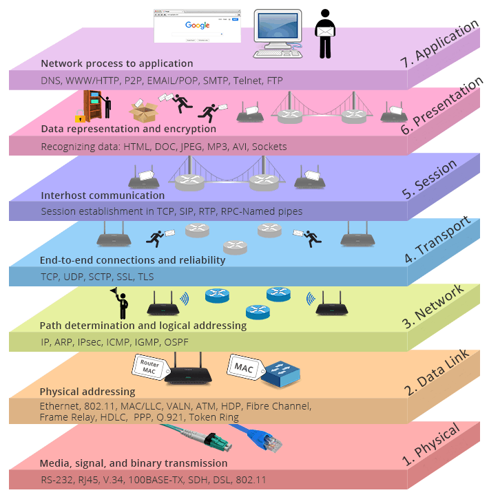

# Modelo OSI

Modelo de referencia que ayuda a determinar problemas con las conexiones de internet


| Modelo OSI |  |
| ---- | ---- |
| *7 Aplicación* |  |
| *6 Presentación* | Lenguaje, código y cifrado de los datos |
| *5 Sesión* | Sistema operativo (iniciar, mantener y finalizar) |
| *4 Transporte* | Habilitar servicios en la red (TCP, UDP) |
| *3 Red* | Buscar la mejor ruta -> métricas (**==Router==**, IPv4, enrutamiento, NAT) |
| *2 Enlace de datos* | Preparar información a un medio diferente (tramas, ARP, Ethernet, **==switches==**, MAC) |
| *1 Física* | (bits, cable suelto) |

# Modelo TCP/IP
| Modelo TCP/IP |  |
| ---- | ---- |
| *4 Aplicación* | (Capa 5, 6 y 7) |
| *3 Transporte* | (Capa 4) |
| *2 Internet* | (Capa 3) |
| 1 Acceso de red* | (Capa 1 y 2 de OSI) |
## Protocolo Ethernet 802.3
- 802.3
- CSMA/CD (Colission Detection)
- Broadcast

### Hub
- No tiene memoria
- Siempre propenso a colisiones
- Trabaja en half-duplex
### Switch
- Tiene memoria
- Separa colisiones por interfaz
- Trabaja en full-duplex
- Verifica direcciones MAC
### Router
- Tiene memoria
- Separa colisiones por interfaz
- Trabaja en full-duplex
- Busca la mejor ruta
### Dominios de colisión
**En Hub**
Tenemos 3 pcs conectadas al Hub
Como trabaja en *half duplex*, si se cae una interfaz se cae todo
Por lo tanto, se tiene 1 dominio de colisión

**Switch**
Tenemos 3pcs conectadas al Switch
Como trabaja en *full duplex*, entonces solo se llega a caer la interfaz de la PC
Por lo tanto, se tienen 3 dominios de colisión

**Router**
Tenemos 3pcs conectadas al Switch
Como trabaja en *full duplex*, entonces solo se llega a caer la interfaz de la PC
Por lo tanto, se tienen 3 dominios de colisión
#### Dominios broadcast
- Dispositivos que pertenecen a la misma red
- El router divide los segmentos de red por interfaz
- **Si no hay router solo hay un segmento de red**

![[ejercicio16-02.JPG]]

# ARP (Address Resolution Protoclol)
- Finalidad de conocer la MAC destino
- Mensaje broadcast
- MAC por defecto FF:FF:FF
- Capa 2

# ICMP ()
- Validar comunicación entre 2 dispositivos
- Mensaje unicast
- Se le conoce como ping
- Capa 3

## Tipos de mensaje
- Unicaste, a uno
- Multicast, a un grupo
- Broadcast, a todos


## Tabla MAC
Para visualizar la tabla MAC del switch
`#sh mac address-table`
`#clear mac address-table dynamic`

Para visualizar la tabla MAC del switch, ver la tabla de enrutamiento y segmentos de red que existen
`#sh ip route`
`#clear mac address-table dynamic`

**Enrutamiento**, proceso de conectar redes remotas (*no estanconectadas "directamente"*) a un router o bien , cuando se tienen redes remotas debemos enrutar

### Comando para enrutar 
```` js
R1#router rip
R1#network 192.168.50.0
R1#network 192.168.1.0 //Solo aplica para enrutar con RIP
--------------------------------------------------------
R2(config)#router rip

R2(config-router)#network 192.168.1.0

R2(config-router)#network 192.168.3.0
------------------------------------------------------------
R3(config)#router rip

R3(config-router)#network 192.168.3.0

R3(config-router)#network 192.168.30.0
````

#### Gateway
Puerta de salida
Es la **IP configurada (ip del router)**
```` js
--------------------------------------------------------

S1(config)#ip default-gateway 192.168.50.254

------------------------------------------------------------

S2(config)#ip default-gateway 192.168.30.254

````
